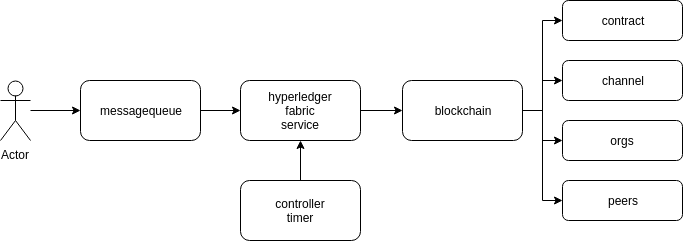
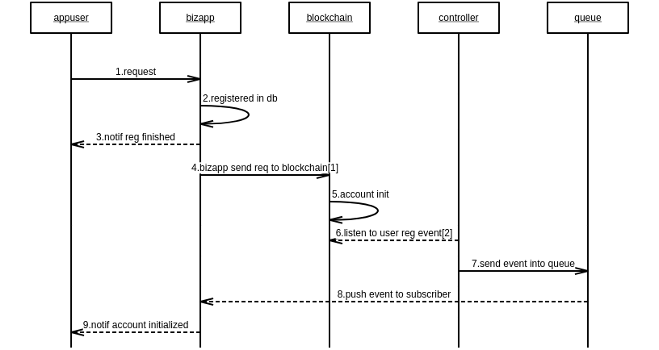
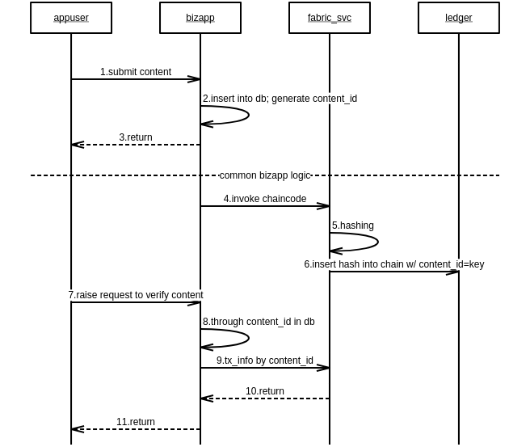

# Token

## Use Cases
- Wallet ID created when user sign-up
- User txns record logged in chain (ledger)
- User can view/ query txns and blockchain info through mobile device and/ or dashboard
- User data-submission record is according to Proof of Data-Contribution (PoDC)
- In-between users can transfer (purchase) token they own in app

## Logic
- The total quantity of token is fixed
- Reward token amount decreases per a certain number of blocks
- Token can come from 2 different ways
  - Initial Token (init): A certain amount of token placed into a user account when sign-up
  - Reward Token (reward): A token rewarded, based on contribution (PoDC)

## Algorithm & Formula
- Reward token

total | init + reward | amt of blk reached when half decreased | minute / block | reward / block
--- | --- | --- | --- | --- |
134,217,728 | 23,546,880 | 52,560 | 10 | 256

Formula:

- (init + reward) = reward/blk * (amt of blk reached when half decreased) * $\sum_{i=0}n \frac{1}{2i}$
 
  which equals to
  23,546,880 = 256 * 52,560 * $\sum_{i=0}n \frac{1}{2i}$
 

- The amount of blocks reached when half decreased: 52,560 = 365 * 24 * 6 = blocks generated per year

- The interval of decrease: 1 year

- Issued ratio = (init + reward) / total * 100% = 17.54%

> Particularly the token is set just in 2 years as client's requirement

<!--
  $
  \sum_{n = 0}^{\infty}
  $

  $$
  \sum_{n = 0}^{\infty}\frac{210,000*50}{2^n} = 210,000*50*\frac{1}{1-\frac{1}{2}} = 21,000,000
  $$   
-->

## BlockChain Data Schema
data | sample | note
--- | --- | --- |
uid | 13900101234 | end user phone number
hash of content | e3b0c442...7852b855 |
previous block hash |  |
block hash |  |
merkle hash |

## Chaincode (SmartContract)
cat | details
--- | ---
user mgmt | registration, delete
token | reward, tx, consume, transfer
content | hashing, storing, query
block generation |  

## APIs (unfinished)
- block invoke & control

## System Architecture

> Architecture Draft credited to Alex

## Data Flow

- User Registration

- Query

